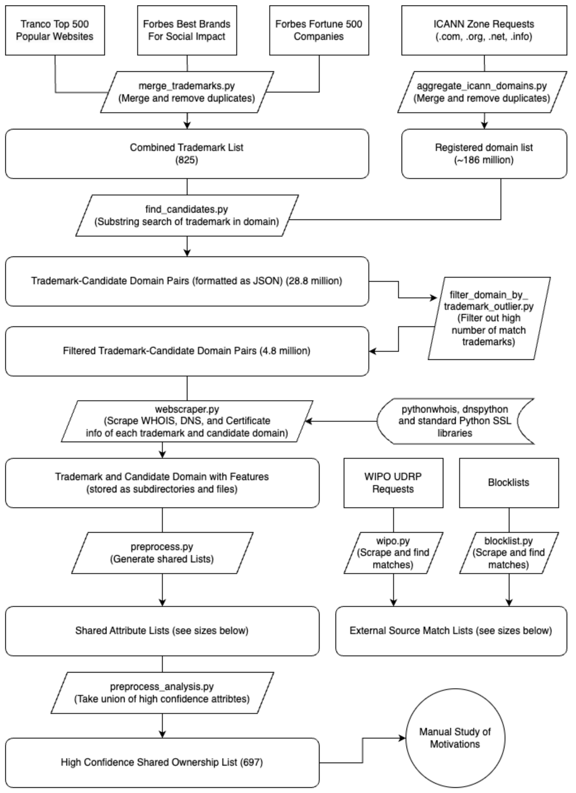

# combosquatting-senior-project

## Repository Structure

```
combosquatting/
|-- src/
|   |-- blocklist_collection/ 
|   |   |-- blackbook.py
|   |   |-- gsb-gglsbl.py
|   |   |-- gsb-http.py
|   |
|   |-- classification/ 
|   |   |-- preprocess.py
|   |
|   |-- data_analysis/ 
|   |   |-- filter_domain_by_trademark_outliers.py
|   |   |-- preprocess_analysis.py
|   |   |-- simple_scrape_analysis.py
|   |   |-- trademark.ipynb
|   |
|   |-- data_collection/
|   |   |-- aggregate_icann_domains.py
|   |   |-- find_candidates.py
|   |   |-- gather_trademarks.py
|   |   |-- webscraper_helper.py
|   |   |-- webscraper_simple.py
|   |   |-- webscraper.py
|   |
|   |-- tranco_collection/
|   |   |-- search_tranco.py
|   |
|   |-- udrp_collection/
|   |   |-- scrape_wipo.py
|   |   |-- search_wipo.py
|
|-- .gitignore              # Specifies intentionally untracked files to ignore
|-- README.md               # Project description and instructions
|-- requirements.txt        # List of python dependencies for this project
```

## Methodology Flowchart


